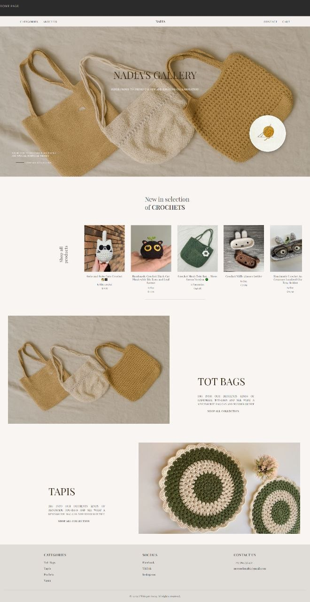
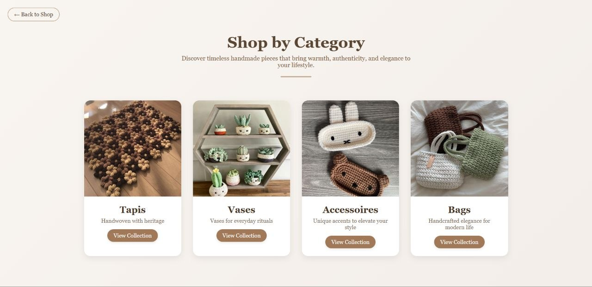
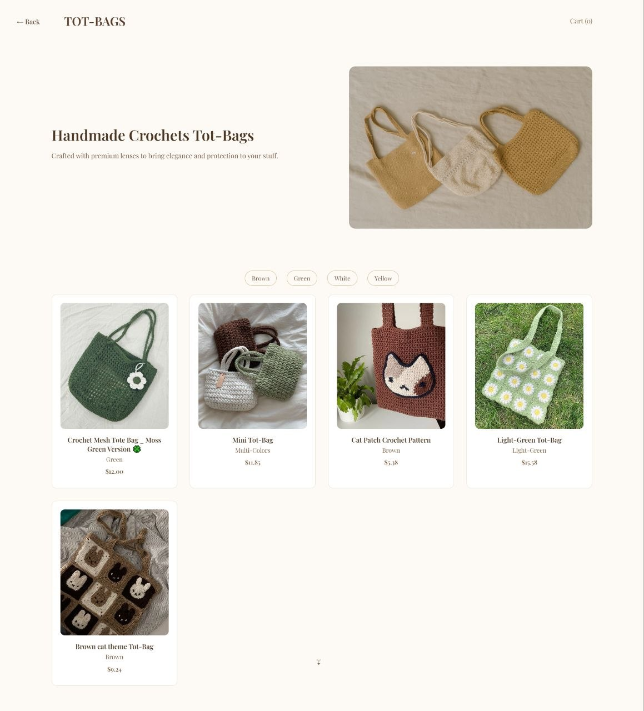
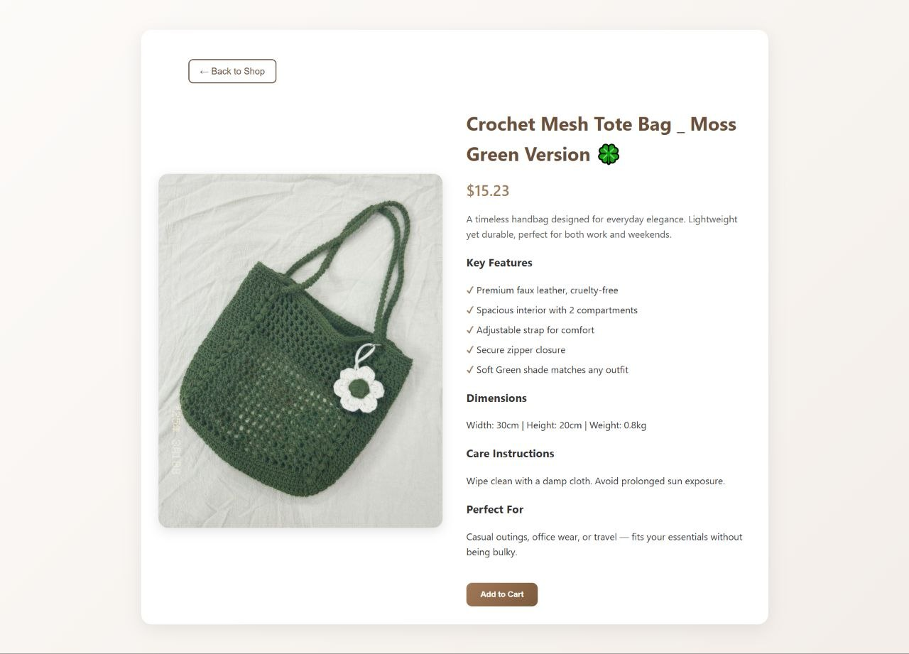
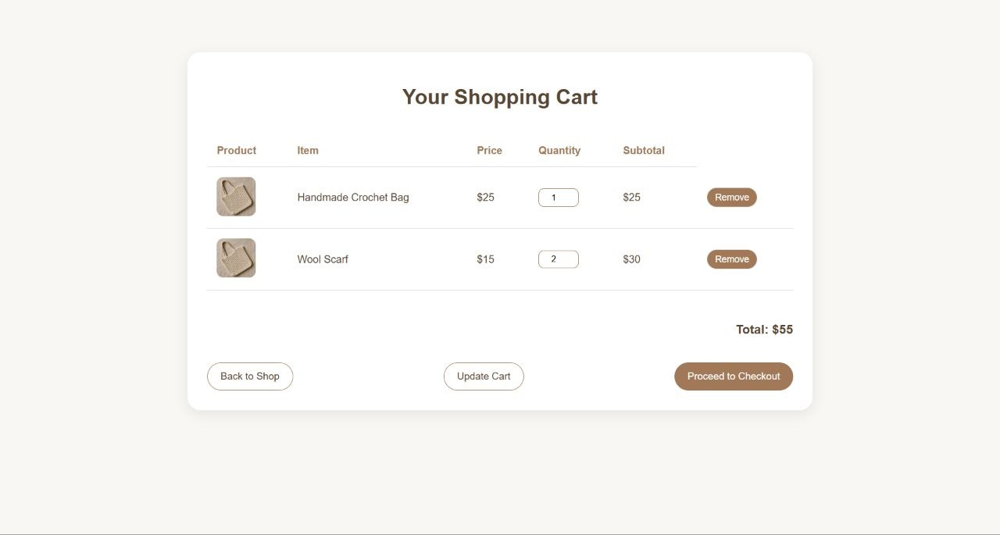
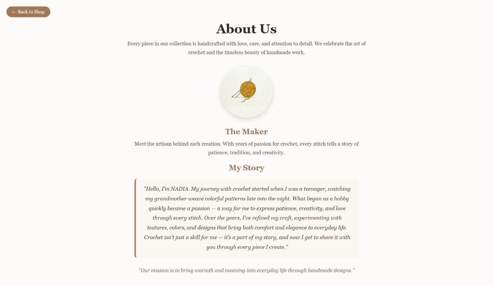
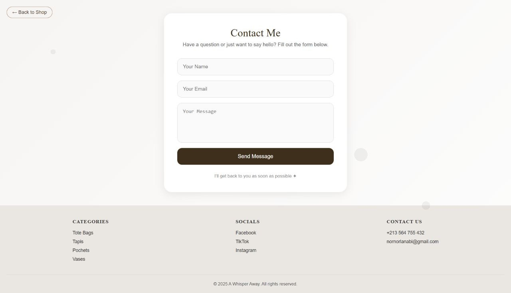

# 🧶 Beginner Crochet Online Store

A front-end online store website for a fictional crochet shop, designed and developed as my **first front-end web development project**.

## 📌 Project Background

This was my first website project when I was a complete beginner in front-end development.

I built it while learning the fundamentals of **HTML, CSS, and JavaScript**. The project reflects my early learning process and experimentation with website structure, navigation, product pages, layouts, styling, and basic shopping-cart interfaces.

At this stage, I was still learning how to organize a web project, so some of the implementation approaches are simple and different from how I would structure a project today.

One example is the product filtering system: instead of using dynamic filtering, I initially created separate pages for different product categories and colors.

I kept the project in its original form to document my early development journey and show my progression as a developer.

---

## 🌸 About the Website

The website presents a fictional handmade crochet store called **Nadia's Gallery**.

Visitors can:

- Browse the home page
- Explore product categories
- Browse crochet tote bags
- Filter tote bags by color
- View product details
- Add products to a shopping cart
- View the shopping cart
- Visit the About Us page
- Use the Contact page
- Navigate between the different sections of the website

---

## ✨ Main Pages

### 🏠 Home Page

The landing page introduces the crochet store and highlights different collections.

### 🛍️ Categories

Products are organized into different categories such as:

- Tote Bags
- Tapis
- Accessories
- Vases

### 👜 Tote Bags Collection

The tote-bag collection contains several products and separate category/color pages.

The project uses a simple page-based filtering approach, with separate pages for colors such as:

- Brown
- Green
- White
- Yellow
- Beige

### 📦 Product Details

The project includes a product-detail page containing:

- Product image
- Product name
- Price
- Description
- Features
- Dimensions
- Care instructions
- Add-to-cart interface

### 🛒 Shopping Cart

The website includes a shopping-cart interface displaying:

- Products
- Prices
- Quantities
- Subtotals
- Total price
- Remove buttons
- Cart actions

### 👩‍🎨 About Us

A fictional artisan profile and story page describing the concept behind the crochet shop.

### 📩 Contact

A contact page containing a simple contact form.

---

## 🖼️ Screenshots

### Home Page

### Categories

### Tote Bags Collection

### Product Details

### Shopping Cart

### About Us

### Contact

---

## 🛠️ Technologies

- HTML5
- CSS3
- JavaScript

---

## 🎯 What I Learned

This project helped me practice:

- Structuring web pages with HTML
- Creating layouts with CSS
- Styling cards, buttons, forms, and navigation
- Linking multiple HTML pages together
- Organizing website content into different sections
- Creating product and category pages
- Building a basic shopping-cart interface
- Working with images and website assets
- Understanding how different pages of a website connect together
- Improving my visual design and front-end development skills

---

## 📚 What I Would Improve Today

Since this was my first front-end project, there are several things I would approach differently today.

For example:

- Use a more organized project structure
- Use reusable components instead of repeating page structures
- Implement dynamic product filtering
- Improve responsiveness for different screen sizes
- Improve accessibility
- Use cleaner and more consistent naming conventions
- Separate data from presentation
- Improve JavaScript functionality
- Use a more scalable approach for product management

These limitations are part of the project's purpose: **it represents my early stage of learning front-end development.**

---

## 📌 Project Status

This is a completed beginner-level learning project.

It is not intended to be a production-ready e-commerce platform. It was created primarily to practice front-end web development and document my early progress.

---

## 👤 Author

**LANABI NOR EL-AMENE**

Biotechnology Engineer & Master's Graduate in Microbial Biotechnology

GitHub:  
https://github.com/Nor-El-Amene